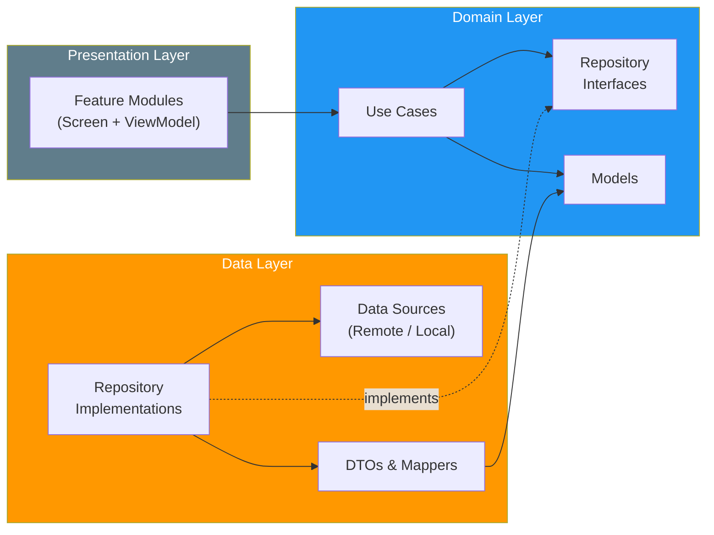
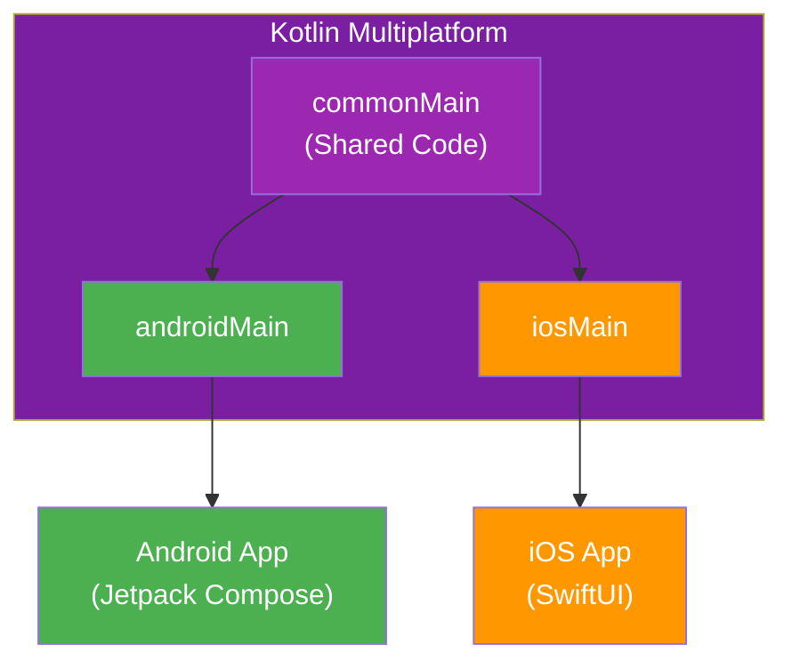

# LinkIt Company

This is a Kotlin Multiplatform project targeting Android, iOS using Clean Architecture.

## Architecture

This project follows **Clean Architecture** with a **multi-module** structure.

### Module Dependency Graph

```mermaid
graph TD
    APP[":app"]

    APP --> FEAT_HOME[":feature:home"]
    APP --> FEAT_CLASS[":feature:classification"]
    APP --> FEAT_ONBOARD[":feature:onboarding"]
    APP --> FEAT_SAVE[":feature:save"]
    APP --> FEAT_SHARE[":feature:share"]
    APP --> FEAT_STORAGE[":feature:storage"]
    APP --> FEAT_EXPLORE[":feature:explore"]
    APP --> FEAT_INTRO[":feature:intro"]
    APP --> FEAT_MAP[":feature:map"]
    APP --> FEAT_SCHEDULE[":feature:schedule"]
    APP --> FEAT_NAV[":feature:navigation"]
    APP --> DATA[":data"]
    APP --> DOMAIN[":domain"]
    APP --> CORE_COMMON[":core:common"]
    APP --> CORE_DS[":core:designsystem"]

    FEAT_HOME --> DOMAIN
    FEAT_HOME --> CORE_COMMON
    FEAT_HOME --> CORE_DS
    FEAT_CLASS --> DOMAIN
    FEAT_CLASS --> CORE_COMMON
    FEAT_CLASS --> CORE_DS
    FEAT_ONBOARD --> DOMAIN
    FEAT_ONBOARD --> CORE_COMMON
    FEAT_ONBOARD --> CORE_DS
    FEAT_SAVE --> DOMAIN
    FEAT_SAVE --> CORE_COMMON
    FEAT_SAVE --> CORE_DS
    FEAT_SHARE --> DOMAIN
    FEAT_SHARE --> CORE_COMMON
    FEAT_SHARE --> CORE_DS
    FEAT_STORAGE --> DOMAIN
    FEAT_STORAGE --> CORE_COMMON
    FEAT_STORAGE --> CORE_DS
    FEAT_EXPLORE --> DOMAIN
    FEAT_EXPLORE --> CORE_COMMON
    FEAT_EXPLORE --> CORE_DS
    FEAT_INTRO --> DOMAIN
    FEAT_INTRO --> CORE_COMMON
    FEAT_INTRO --> CORE_DS
    FEAT_MAP --> DOMAIN
    FEAT_MAP --> CORE_COMMON
    FEAT_MAP --> CORE_DS
    FEAT_SCHEDULE --> DOMAIN
    FEAT_SCHEDULE --> CORE_COMMON
    FEAT_SCHEDULE --> CORE_DS

    DATA --> DOMAIN
    DATA --> CORE_COMMON
    DOMAIN --> CORE_COMMON
    CORE_DS --> CORE_COMMON

    style APP fill:#4CAF50,color:#fff
    style DATA fill:#FF9800,color:#fff
    style DOMAIN fill:#2196F3,color:#fff
    style CORE_COMMON fill:#9C27B0,color:#fff
    style CORE_DS fill:#9C27B0,color:#fff
    style FEAT_HOME fill:#607D8B,color:#fff
    style FEAT_CLASS fill:#607D8B,color:#fff
    style FEAT_ONBOARD fill:#607D8B,color:#fff
    style FEAT_SAVE fill:#607D8B,color:#fff
    style FEAT_SHARE fill:#607D8B,color:#fff
    style FEAT_STORAGE fill:#607D8B,color:#fff
    style FEAT_EXPLORE fill:#607D8B,color:#fff
    style FEAT_INTRO fill:#607D8B,color:#fff
    style FEAT_MAP fill:#607D8B,color:#fff
    style FEAT_SCHEDULE fill:#607D8B,color:#fff
    style FEAT_NAV fill:#607D8B,color:#fff
```



### Clean Architecture Layers



### Platform Targets



**For detailed architecture explanation, see [ARCHITECTURE.md](./ARCHITECTURE.md)**

## Project Structure

* [/app-shared](./app-shared/src) is the shared module that integrates all features.
  - [commonMain](./app-shared/src/commonMain/kotlin) is for code that's common for all targets.
  - Platform-specific folders contain platform-specific implementations.

* [/core](./core) contains shared modules used across the entire project.

* [/domain](./domain) contains business logic and repository interfaces.

* [/data](./data) contains data sources and repository implementations.

* [/feature](./feature) contains feature modules with UI and ViewModels.

* [/app-ios](./app-ios/app-ios) contains iOS application entry point.

### Build and Run Android Application

To build and run the development version of the Android app, use the run configuration from the run widget
in your IDE's toolbar or build it directly from the terminal:
- on macOS/Linux
  ```shell
  ./gradlew :app-android:assembleDebug
  ```
- on Windows
  ```shell
  .\gradlew.bat :app-android:assembleDebug
  ```

### Build and Run iOS Application

To build and run the development version of the iOS app, use the run configuration from the run widget
in your IDE's toolbar or open the [/app-ios](./app-ios) directory in Xcode and run it from there.

---

Learn more about [Kotlin Multiplatform](https://www.jetbrains.com/help/kotlin-multiplatform-dev/get-started.html)…
