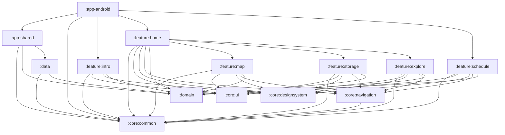
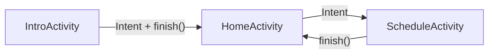
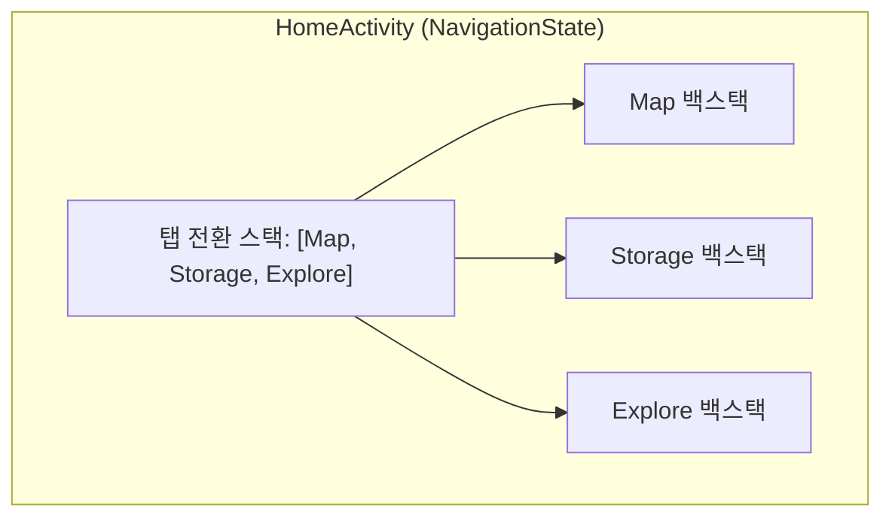
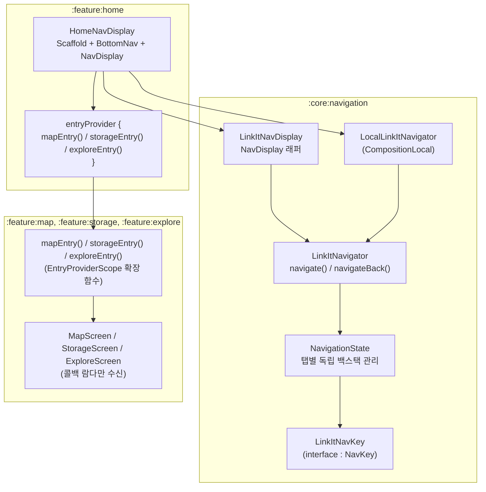

# Navigation3 구조 정리

> 최종 업데이트: 2026-04-03

## 변경 이력

| 날짜 | 내용 |
|------|------|
| 2026-04-03 | 멀티 백스택 구조, 멀티 액티비티 구조, Entry Provider 패턴 반영 |

---

## 모듈 의존성 그래프



---

## 네비게이션 계층 구조

이 프로젝트는 **멀티 액티비티** + **Navigation3 멀티 백스택** 구조를 사용합니다.

```
Activity 레벨 (Intent로 전환)
├── IntroActivity ──Intent──→ HomeActivity
├── HomeActivity (바텀네비 호스트)
│   └── Navigation3 멀티 백스택
│       ├── Map 탭 백스택
│       ├── Storage 탭 백스택
│       └── Explore 탭 백스택
└── ScheduleActivity
    └── Navigation3 단일 백스택
        ├── ScheduleEdit (시작 route)
        └── (확장 가능)
```

### Activity 간 전환



### HomeActivity 내부 탭 전환



---

## 핵심 컴포넌트

### core:navigation 모듈



### 주요 파일 경로

| 파일 | 역할 |
|------|------|
| `core/navigation/.../LinkItRoute.kt` | `LinkItNavKey` Route 정의 + `LinkItSavedStateConfiguration` |
| `core/navigation/.../NavigationState.kt` | 멀티 백스택 상태 관리 + `rememberNavigationState()` + `toDecoratedEntries()` |
| `core/navigation/.../LinkItNavigator.kt` | 탭 전환 / 탭 내 push / back 처리 |
| `core/navigation/.../LinkItNavDisplay.kt` | NavDisplay 래퍼 + `LocalLinkItNavigator` |
| `feature/home/.../navigation/HomeNavDisplay.kt` | Scaffold + BottomNav + entryProvider 조립 |
| `feature/home/.../navigation/TopLevelRoutes.kt` | 탭 정의 (Map, Storage, Explore) |
| `feature/*/navigation/*Entry.kt` | 각 feature의 Route → Screen 매핑 |

---

## Route 정의

```kotlin
interface LinkItNavKey : NavKey {
    // Top-level (탭)
    data object Map : LinkItNavKey
    data object Storage : LinkItNavKey
    data object Explore : LinkItNavKey

    // Sub-route
    data object ScheduleEdit : LinkItNavKey
}
```

Route는 `core:navigation`에 중앙 집중 정의됩니다. `LinkItNavKey`는 `sealed`가 아닌 open `interface`이므로, polymorphic serialization을 위해 `LinkItSavedStateConfiguration`에 수동으로 serializer를 등록해야 합니다:

```kotlin
private val linkItSerializersModule = SerializersModule {
    polymorphic(NavKey::class) {
        subclass(LinkItNavKey.Map::class, LinkItNavKey.Map.serializer())
        subclass(LinkItNavKey.Storage::class, LinkItNavKey.Storage.serializer())
        subclass(LinkItNavKey.Explore::class, LinkItNavKey.Explore.serializer())
        subclass(LinkItNavKey.ScheduleEdit::class, LinkItNavKey.ScheduleEdit.serializer())
    }
}

val LinkItSavedStateConfiguration = SavedStateConfiguration {
    serializersModule = linkItSerializersModule
}
```

---

## NavigationState

탭별 독립 백스택을 관리합니다.

```kotlin
class NavigationState(
    val startRoute: NavKey,
    val topLevelStack: NavBackStack<NavKey>,              // 활성 탭 순서
    val backStacks: Map<NavKey, NavBackStack<NavKey>>,    // 탭별 백스택
) {
    val currentTopLevelRoute: NavKey      // 현재 선택된 탭
    val currentRoute: NavKey              // 현재 탭의 최상위 화면
    val topLevelRoutes: Set<NavKey>       // 모든 탭 목록
    val currentTopLevelBackStack          // 현재 탭의 백스택
}
```

생성:

```kotlin
val navigationState = rememberNavigationState(
    savedStateConfiguration = LinkItSavedStateConfiguration,
    startRoute = LinkItNavKey.Map,
    topLevelRoutes = setOf(LinkItNavKey.Map, LinkItNavKey.Storage, LinkItNavKey.Explore),
)
```

---

## LinkItNavigator API

```kotlin
class LinkItNavigator(private val navigationState: NavigationState) {
    fun navigate(target: NavKey)
    fun navigateBack()
}
```

### navigate(target) 동작

| 상황 | 동작 |
|------|------|
| `target`이 현재 탭과 동일 | 현재 탭 백스택을 루트로 초기화 |
| `target`이 다른 탭 | 해당 탭으로 전환 (기존 상태 보존) |
| `target`이 탭이 아닌 route | 현재 탭 백스택에 push (중복 방지: remove → add) |

### navigateBack() 동작

| 상황 | 동작 |
|------|------|
| 현재 화면이 탭 루트 | 이전 탭으로 전환 (topLevelStack pop) |
| 현재 화면이 서브 route | 현재 탭 백스택에서 pop |

---

## Entry Provider 패턴

각 feature 모듈이 `navigation/` 패키지에 자체 entry를 정의합니다.

### feature 모듈에서 정의

```kotlin
// feature:map/navigation/MapEntry.kt
fun EntryProviderScope<NavKey>.mapEntry(
    onOpenSchedule: () -> Unit,
    navigateToScheduleEdit: () -> Unit,
) {
    entry<LinkItNavKey.Map> {
        MapScreen(
            onOpenSchedule = onOpenSchedule,
            navigateToScheduleEdit = navigateToScheduleEdit,
        )
    }
}
```

### 호스트에서 조립

```kotlin
// feature:home/navigation/HomeNavDisplay.kt
val entryProvider = entryProvider {
    mapEntry(
        onOpenSchedule = { navigateToScheduleEdit() },
        navigateToScheduleEdit = { navigateToScheduleEdit() },
    )
    storageEntry()
    exploreEntry()
}
```

Screen Composable은 Navigation에 대한 직접 의존 없이 **콜백 람다**만 수신합니다.

---

## 새 Route 추가 체크리스트

1. `core:navigation/LinkItRoute.kt`에 `LinkItNavKey`의 새 data object 추가
2. `LinkItSavedStateConfiguration`의 polymorphic 블록에 serializer 등록
3. feature 모듈에 `navigation/XxxEntry.kt` 생성
4. 호스트의 `entryProvider` 블록에 entry 추가

---

## 참고 문서

- [Navigation3 공식 문서](https://developer.android.com/jetpack/androidx/releases/navigation3)
- [프로젝트 아키텍처](ARCHITECTURE.md)
- [Metro DI 가이드](METRO_INSTRUCTION.md)
