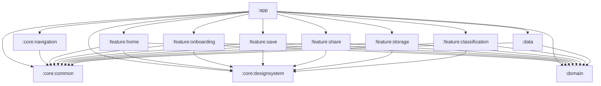
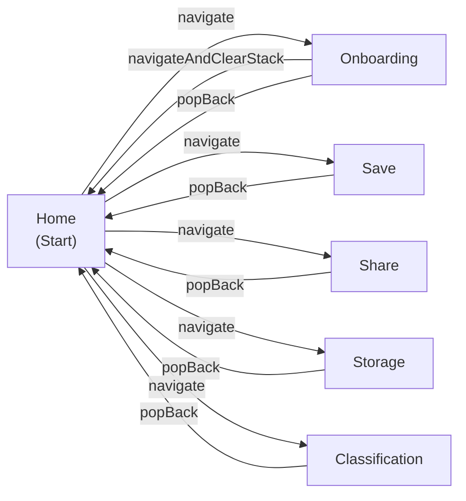
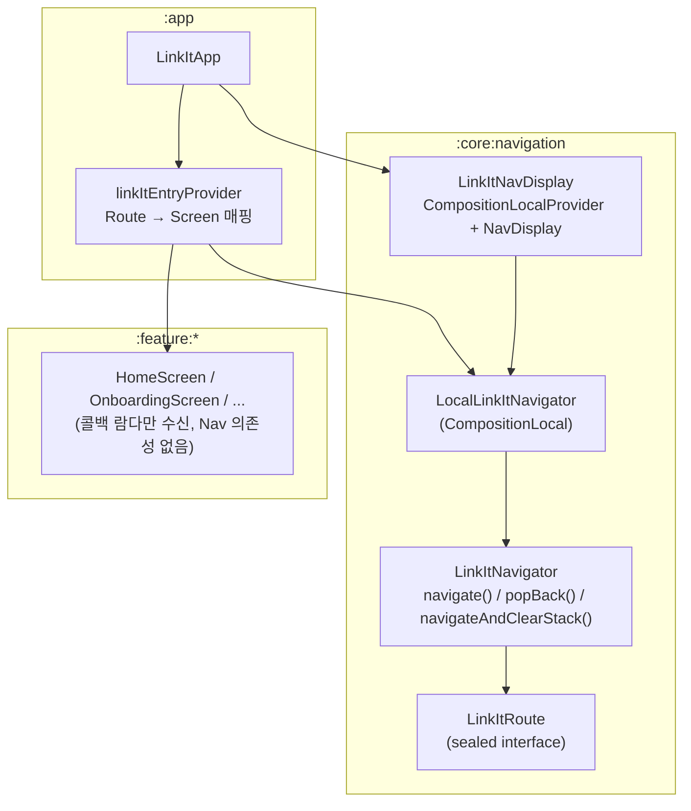

# Navigation3 구조 정리

## 모듈 의존성 그래프

## 화면 네비게이션 플로우

## 핵심 컴포넌트 구조

## 주요 파일 경로

| 파일　　　　　　　　　　　　　　　　　　　　| 역할　　　　　　　　　　　　　　　　　　　　 |
| ---------------------------------------------| ----------------------------------------------|
| `core/navigation/.../LinkItRoute.kt`　　　　| `@Serializable sealed interface` 라우트 정의 |
| `core/navigation/.../LinkItNavigator.kt`　　| 백스택 래퍼 (안전한 API만 노출)　　　　　　　|
| `core/navigation/.../LinkItNavDisplay.kt`　 | NavDisplay + CompositionLocal 제공　　　　　 |
| `app/.../navigation/LinkItEntryProvider.kt` | Route → Screen 매핑 (entryProvider DSL)　　　|
| `app/.../LinkItApp.kt`　　　　　　　　　　　| 진입점 (Theme + NavDisplay 조합)　　　　　　 |
| `feature/*/.../*Screen.kt`　　　　　　　　　| 순수 UI 컴포저블 (콜백 람다)　　　　　　　　 |

## LinkItNavigator API

| 메서드 | 동작 | 안전장치 |
|--------|------|----------|
| `navigate(route)` | 백스택에 추가 | - |
| `popBack()` | 마지막 항목 제거 | `size > 1` 가드 (빈 스택 방지) |
| `navigateAndClearStack(route)` | 스택 초기화 후 새 루트 설정 | `Snapshot.withMutableSnapshot` 원자적 처리 |
